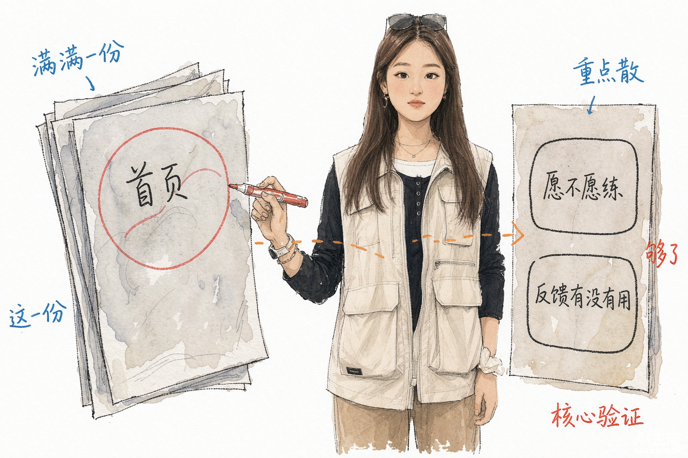
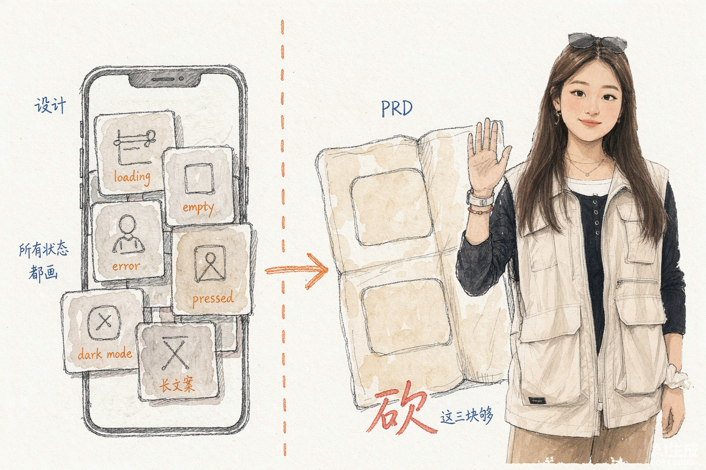
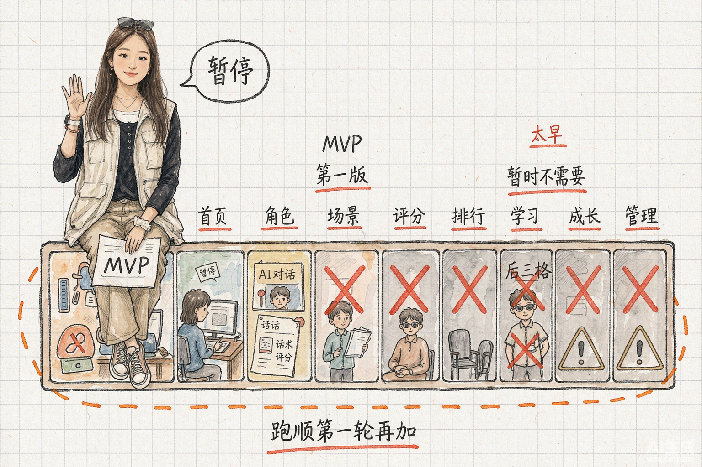
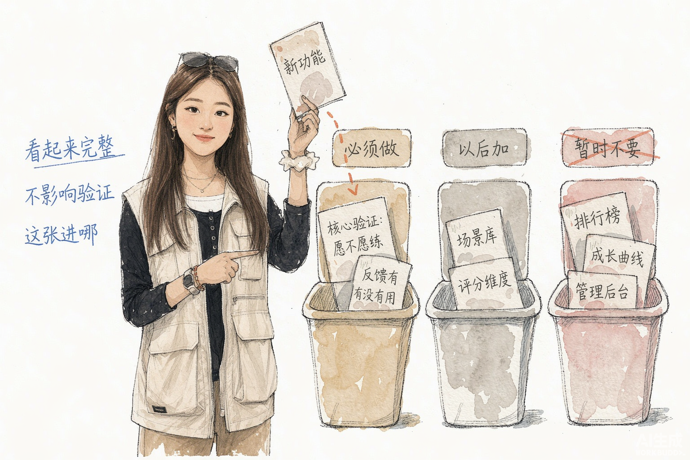
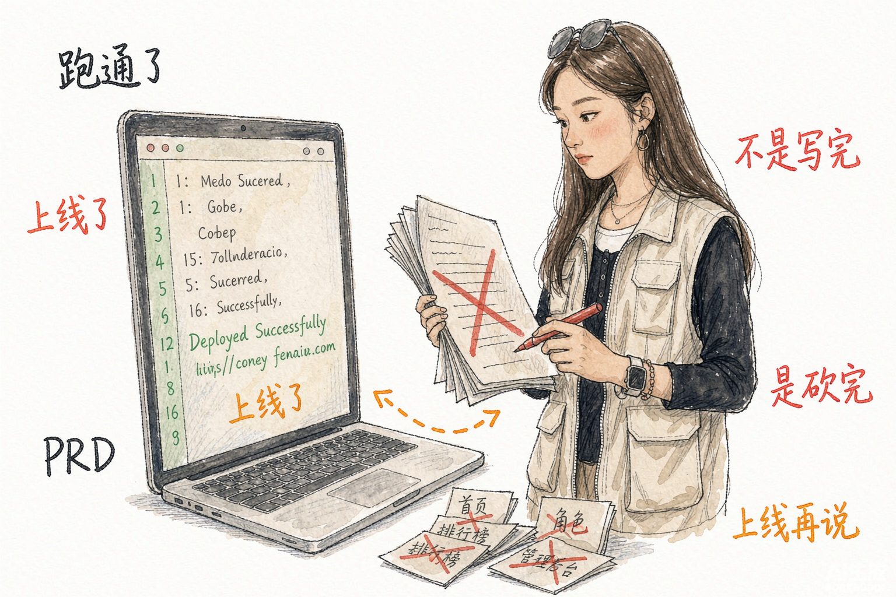

# Xiaoyu Illustrations

> 把中文文章里的判断、流程、状态和隐喻，变成一张张干净背景、淡彩手绘、清爽自然的正文配图。
>
> 16:9 横版 | 小玉 IP | 淡彩手绘速写 | 少量红橙蓝中文批注 | Codex Skill

---

## 这个仓库是什么

Xiaoyu Illustrations 是一个 Codex Skill，用来指导 AI Agent 为中文文章、帖子、博客、Notion 文档和方法论内容生成正文配图。

它不是通用插画 prompt，也不是 PPT 信息图模板。它的核心目标是：先理解文章里的认知锚点，再把其中一个判断、流程、结构、状态或隐喻，变成一张有记忆点的 16:9 手绘解释图。

默认视觉 IP 是"小玉"：留着长直发、头顶常架着一副墨镜、身穿米色工装马甲内搭黑色长袖的年轻女性。小玉在画面中以淡彩手绘速写呈现，有自然肤色与柔和阴影，留有铅笔/水彩质感；不做成照片、3D 渲染或过度可爱的吉祥物。小玉不是贴纸，也不是站在角落里的装饰物，而是正在认真参与系统运转的荒诞工作者。

一句话：**让 AI 不只是"配一张图"，而是把文章里的一个关键认知动作画出来。**

---

## 适合谁用

特别适合：

- 写中文文章，需要正文配图和文章插图的人
- 做知识型内容、方法论内容、AI 工作流内容的人
- 想把抽象判断画成具体隐喻的人
- 想要一种比 PPT 信息图更轻、更怪、更有个人识别度的配图风格的人
- 用 Codex 做内容生产，希望稳定复用一套视觉语言的人

不适合：

- 想要商业插画、品牌 KV 或精致扁平插画的人
- 想要传统 PPT 信息图、复杂架构图或流程图的人
- 想要儿童卡通、可爱 IP、表情包风格的人
- 想把大量正文、长段解释或完整课程页塞进一张图里的人
- 需要严格可编辑矢量源文件的人

---

## 它会产出什么

默认输出：

- 16:9 横版正文配图
- 一篇文章的 4-8 张 shot list
- 每张图的主题、核心意思、结构类型、小玉动作和中文标注建议
- 最终 PNG 图片，保存到 workspace 的 `assets/<article-slug>-illustrations/`

默认不输出：

- PPTX / PDF / Keynote
- SVG / HTML / Canvas 可编辑图
- 商业海报或封面 KV
- 大段文字型信息图

---

## 视觉风格

这个 skill 默认使用"小玉淡彩手绘正文配图"风格：

- 干净背景：以纯白或接近透明为主，可以有极淡投影；不要复杂场景、渐变、纹理墙面。
- 淡彩手绘速写质感：保留铅笔/炭笔线条的轻重变化，线条不完全平滑，也不过度抖动。
- 自然上色：小玉有肤色、发色、服装固有色；物件可以带淡彩，但饱和度低，像水彩薄涂。
- 柔和体积感：允许轻微明暗和阴影让画面有厚度，拒绝重阴影、强烈对比、照片级写实。
- 大量留白：主体占画面约 40%-60%，至少 35% 空白。
- 少量中文手写批注：最多 5-8 处，每处 2-8 个字，红色用于重点批注、橙色用于主流向、蓝色用于补充说明。
- 一张图只表达一个核心动作、结构、状态或隐喻。
- 小玉必须承担核心动作，不能只是装饰；如果去掉小玉画面仍然完全成立，说明小玉太装饰了。
- 清爽、自然、有生活感、有速写灵气；怪诞但不突兀；不要可爱、幼稚、商业、3D 塑料感。

---

## 示例效果

下面 5 张配图来自同一篇 PRD 反思长文（《PRD 越写越长，是产品经理在偷懒》），用本 skill 一次性生成。

### PRD 写得满但说不清



### 设计与 PRD 思考方式的差异



### MVP 被塞太满



### 三个桶的取舍：必须做 / 以后加 / 暂时不要



### 靠演示把 PRD 砍下来



这些图片是风格校准样例，不是构图模板。使用时应该从当前文章重新发明隐喻，不要照抄这张样例的物件和构图。

---

## 安装

克隆本仓库：

```bash
git clone <repository-url>
cd xiaoyu-illustrations
```

复制 skill 到 Codex skills 目录：

```bash
mkdir -p "${CODEX_HOME:-$HOME/.codex}/skills"
cp -R ./xiaoyu-illustrations "${CODEX_HOME:-$HOME/.codex}/skills/"
```

安装后，在 Codex 里使用：

```text
Use $xiaoyu-illustrations 为这篇中文文章设计并生成 5 张小玉淡彩手绘正文配图。
```

---

## 怎么用

### 只做配图规划

```text
Use $xiaoyu-illustrations 先不要生图。
请分析下面这篇文章哪里值得配图，输出 5 张左右的 shot list。
每张图写清楚：放在哪段后、主题、核心意思、结构类型、小玉在做什么、建议中文标注词。

<粘贴文章>
```

### 直接生成正文配图

```text
Use $xiaoyu-illustrations 把下面这篇文章生成 4 张小玉淡彩手绘正文配图。
要求：16:9 横版、干净背景、淡彩手绘速写、少量红橙蓝中文手写批注。

<粘贴文章>
```

### 为单个概念生成一张图

```text
Use $xiaoyu-illustrations 为"信任不是喊出来的，而是一块证据一块证据铺过去"生成一张正文配图。
画面要自然、清爽、有速写灵气，小玉必须承担核心动作。
```

### 去掉图里的标题或错误文字

```text
Use $xiaoyu-illustrations 帮我编辑这张图，去掉左上角的"流程图"标题，其他内容保持不变。
```

更多示例见 [examples/prompts.md](examples/prompts.md)。

---

## 工作流程

这个 skill 的流程是：

1. 读取文章、Markdown、Notion 内容、截图或用户给的主题
2. 提炼核心观点、认知转折、流程结构和适合视觉化的段落
3. 先输出 shot list：每张图只选一个认知锚点
4. 为每张图选择结构类型：Workflow、系统局部、前后对比、角色状态、概念隐喻、方法分层、地图路线或小漫画分镜
5. 重新发明一个低科技、怪诞但成立的物理隐喻
6. 让小玉承担核心动作
7. 每张图单独调用图像模型生成
8. 按 QA checklist 检查：干净背景、留白、小玉动作、中文标注、非 PPT 感、非旧案例复刻
9. 保存最终 PNG，并报告用途和路径

---

## 目录结构

```text
.
├── README.md
├── LICENSE
├── examples/
│   ├── images/
│   │   ├── 01-prd-overfull-not-clear.png
│   │   ├── 02-design-vs-prd-thinking.png
│   │   ├── 03-mvp-overloaded.png
│   │   ├── 04-three-buckets.png
│   │   └── 05-prd-trimmed-by-demo.png
│   └── prompts.md
└── xiaoyu-illustrations/
    ├── SKILL.md
    ├── agents/
    │   └── openai.yaml
    ├── assets/
    │   └── examples/
    └── references/
        ├── style-dna.md
        ├── xiaoyu-ip.md
        ├── composition-patterns.md
        ├── prompt-template.md
        └── qa-checklist.md
```

真正需要安装到 Codex 的是子目录：

```text
xiaoyu-illustrations/
```

根目录的 README、LICENSE 和 examples 是 GitHub 分享文档。

---

## 注意事项

- 图片里的中文文字越短越稳定。
- 每张图只讲一个核心结构，不要把文章做成说明书。
- 小玉必须承担核心动作；如果去掉小玉画面仍然完全成立，说明小玉太装饰了。
- 示例图只用于校准线条密度、留白、颜色克制和小玉参与方式，不要复刻构图。
- AI 图像模型可能出现错字、幻觉标签、风格漂移或多余标题，生成后需要检查。
- 如果中文错字严重，优先减少标注词并重生成。

---

## License

MIT License. See [LICENSE](LICENSE).
